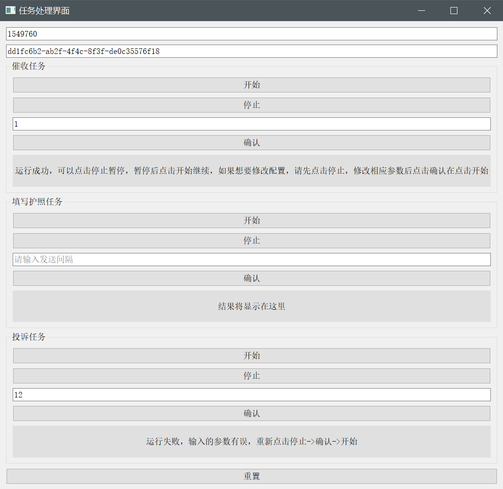

# 使用说明

软件界面如图，包含三个任务：

* 催促收货
* 催促填写护照
* 投诉跟卖
* 重置：重置所有的任务

每个任务下包含如下，并只对当前任务有效

* 按键：
  * 开始：开始任务
  * 停止：暂停，停止任务
  * 确认：确认参数
* 输入框：输入任务执行频率，单位 s
* 显示框：显示任务执行成功与否

# 注意事项

1. 执行***投诉跟卖***时，代码会扫描您仓库里的所有***正在销售中***商品，检查它们的跟卖情况并投诉，***所有商品检查完以后才算一次执行完毕***，所有当您想要在一次循环还未执行完毕时点击停止，操作步骤为：
   * 点击停止，这时软件会卡住，不需理会
   * 关闭弹出来的谷歌浏览器页面
   * 软件恢复，并且弹出点击成功
   * 这时你可以进行其他操作了
2. 投诉跟卖时，偶尔会出现验证情况，需要人为手动验证，操作步骤：
   * 点击 执行文件（TODO）
   * 弹出浏览器界面时，关闭执行文件，手动点击验证
   * 就可以正常使用软件了
   * 当软件使用时再次出现验证界面。重复执行以上步骤
